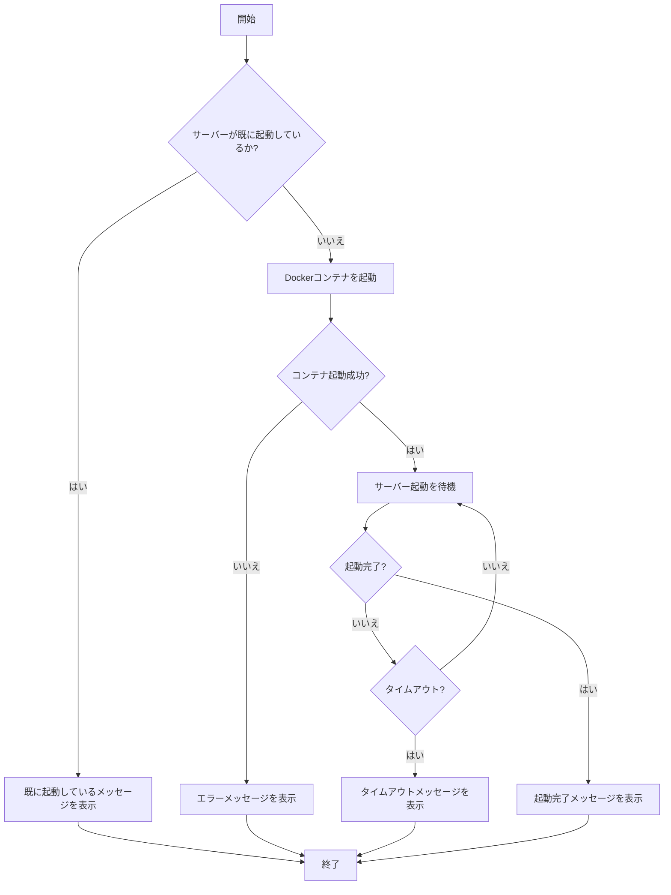
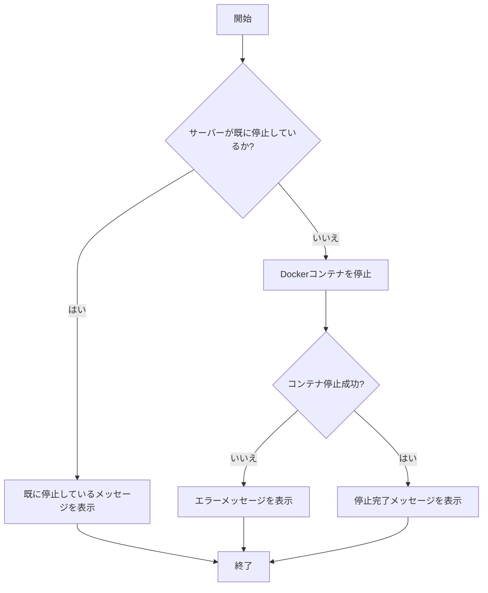
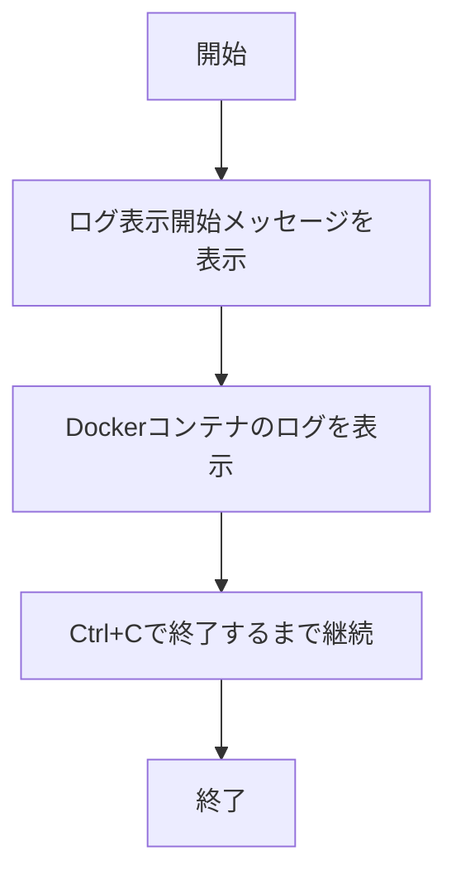
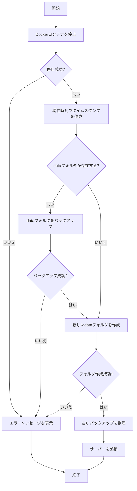

# Minecraft サーバー Docker プロジェクト

## 概要

このプロジェクトは、Dockerを使用してMinecraftサーバーを簡単に構築・管理するためのツールセットです。Docker技術を利用することで、サーバーのセットアップや管理が簡単になり、異なるOSでも同じ環境でサーバーを実行できます。

Minecraftゲーム内のハードコアモードをベースとした「IkeikeWorld」サーバーが、このプロジェクトのデフォルト設定として含まれています。

## 前提条件

- **Docker Desktop**: このプロジェクトを実行するために必要です。[Docker Desktop公式サイト](https://www.docker.com/products/docker-desktop/)からダウンロードしてインストールしてください。
- **Minecraft Java Edition**: サーバーに接続するためには、プレイヤーはMinecraft Java Editionのクライアントが必要です。

## セットアップ方法（初心者向け）

1. **プロジェクトのダウンロード**:
   - このページの上部にある「Code」ボタン（緑色）をクリックし、「Download ZIP」を選択します。
   - ダウンロードしたZIPファイルを右クリックして「すべて展開」を選択し、好きな場所に展開します。
   - 展開されたフォルダを開きます。

2. **Docker Desktopのインストール**:
   - [Docker Desktop公式サイト](https://www.docker.com/products/docker-desktop/)にアクセスします。
   - お使いのOSに合わせたバージョンをダウンロードします（Windows、Mac対応）。
   - ダウンロードしたインストーラーを実行し、画面の指示に従ってインストールします。
   - インストール完了後、Docker Desktopを起動します（スタートメニューやDockerアイコンから）。
   - タスクバーにあるDockerアイコンが動いていない（起動完了）ことを確認します。

3. **サーバーの起動**:
   - 展開したフォルダ内にある `start.bat` ファイルをダブルクリックします。
   - コマンドプロンプトウィンドウが開き、サーバーの起動プロセスが開始されます。
   - 初回起動時はDockerイメージのダウンロードが行われるため、インターネット接続状況によっては時間がかかることがあります。
   - 「Minecraftサーバーの起動が完了しました！」というメッセージが表示されたら準備完了です。

4. **サーバーへの接続**:
   - Minecraft Java Editionを起動します。
   - 「マルチプレイ」→「サーバーを追加」を選択。
   - サーバーアドレスに `localhost` を入力し、「完了」をクリックします。
   - 追加したサーバーを選択して「サーバーに接続」をクリックします。

## 基本的な使い方

### サーバーの起動（start.bat）
サーバーを開始するには、`start.bat`をダブルクリックします。サーバーの起動状態を確認し、すでに起動している場合はメッセージを表示します。起動していない場合は、Dockerコンテナを起動してMinecraftサーバーが完全に起動するまで待機します。

### サーバーの停止（stop.bat）
サーバーを安全に停止するには、`stop.bat`をダブルクリックします。サーバーが実行中かどうかを確認し、実行中であればDockerコンテナを安全に停止します。

### ログの表示（logs.bat）
サーバーのログをリアルタイムで確認するには、`logs.bat`をダブルクリックします。これにより、サーバーの動作状況やエラーメッセージを確認できます。ログの表示を終了するには、キーボードで`Ctrl+C`を押します。

### サーバーのリセット（reset.bat）
サーバーを初期状態に戻すには、`reset.bat`をダブルクリックします。これにより現在のサーバーデータがバックアップされ、新しいワールドで再起動されます。

## データの管理について

### データフォルダについて
- サーバーのすべてのデータは `data` フォルダに保存されます。
- このフォルダには、ワールドデータ、プレイヤーデータ、設定ファイルなどが含まれます。

### バックアップの仕組み
- `reset.bat` を実行すると、現在の `data` フォルダの内容が **自動的にバックアップ** されます。
- バックアップは `data_backup_YYYYMMDDHHMMSS` という形式の名前のフォルダに保存されます（YYYYMMDDHHMMSSは日時）。
- **重要**: このバックアップは、リセット時にのみ作成されます。サーバー稼働中の自動バックアップ機能はありません。

### バックアップの制限と復元方法
- システムは **最新3回分のバックアップのみを保持** します。それ以前のバックアップは自動的に削除されます。
- バックアップから復元するには：
  1. サーバーを停止します（`stop.bat`を実行）。
  2. 現在の `data` フォルダの名前を変更するか削除します。
  3. 復元したいバックアップフォルダ（例：`data_backup_20250425080235`）の名前を `data` に変更します。
  4. サーバーを起動します（`start.bat`を実行）。

### 手動バックアップの推奨
- 重要なワールドデータがある場合は、定期的に手動でバックアップを取ることをお勧めします。
- 手動バックアップの方法：
  1. サーバーを停止します（`stop.bat`を実行）。
  2. `data` フォルダ全体をコピーして、別の場所に保存します。
  3. サーバーを再起動します（`start.bat`を実行）。

## サーバー設定

`docker-compose.yml`ファイルにサーバーの設定が含まれています。このファイルは[setupmc.com](https://setupmc.com/java-server/)で簡単に生成できます。

現在の設定は以下の通りです：

- **メモリ**: 8192MB (8GB)
- **最大プレイヤー数**: 15人
- **サーバー名**: "A Minecraft Server powered Docker"
- **難易度**: ハード(3)
- **ハードコアモード**: 有効
- **ワールド名**: "IkeikeWorld <Hardcore>"
- **スポーン保護**: 無効(0)
- **飛行許可**: 有効
- **タイムゾーン**: 日本(Asia/Tokyo)

## カスタマイズ方法

サーバーの設定を変更したい場合は、以下の方法があります：

1. [setupmc.com](https://setupmc.com/java-server/)にアクセスし、好みの設定でYAMLファイルを再生成します。
2. 生成されたYAMLの内容で、プロジェクト内の`docker-compose.yml`ファイルを上書きします。
3. `reset.bat`を実行して、サーバーを新しい設定でリセットします。

※注意: リセットすると既存のワールドデータは自動的にバックアップされますが、新しいワールドが作成されます。

## トラブルシューティング

### サーバーが起動しない場合
- Docker Desktopが起動しているか確認してください。
- ポート25565が他のアプリケーションで使用されていないか確認してください。
- `logs.bat`を実行して、詳細なエラーメッセージを確認してください。

### サーバーに接続できない場合
- `localhost`または`127.0.0.1`でMinecraftクライアントから接続を試みてください。
- ファイアウォールがMinecraftのポート(25565)をブロックしていないか確認してください。

### Docker関連のエラー
- Docker Desktopを再起動してみてください。
- Windows Updateが完了していることを確認してください。
- Docker Desktopのインストールに必要な要件（Windows 10 Proなど）を満たしているか確認してください。

## 注意事項

- このプロジェクトはDocker技術を使用しているため、Docker Desktopのインストールが必須です。
- サーバーの性能はホストマシンのスペックに依存します。特にメモリ使用量が大きいため、8GB以上のRAMを搭載したマシンでの使用をお勧めします。
- Minecraft Java Editionのサーバーであるため、統合版(Bedrock Edition)のクライアントからは接続できません。

## バッチファイルの処理フロー詳細

以下は、各バッチファイルの処理フローを視覚的に説明したものです。

### start.bat のフロー

### stop.bat のフロー

### logs.bat のフロー

### reset.bat のフロー

